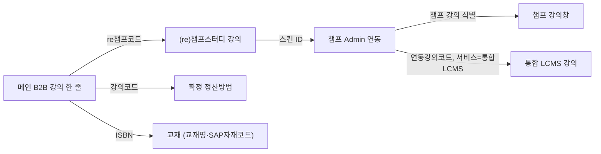

# 1. 시스템 개요

**Lecture Master ERP(B2B 강의리스트)**는 B2B 강의를 표로 조회·검색·필터링하고, 강의 묶음을 저장·관리하며, Re챔프·챔프·통합 LCMS·교재 정보를 한 흐름으로 열어보는 **웹 프로토타입**입니다. 사용자는 **웹 브라우저에서 이 화면을 연 뒤**, 메뉴와 표를 통해 위 기능을 사용합니다.

## 배경: 식별자 분산과 B2C 기준 연동

- **한 강의**가 **B2B 강의코드·B2C 강의코드·스킨 ID·운영자 강의코드** 등으로 **시스템·화면마다 쪼개져** 있어, 관리·운영·영업에서 **같은 강의를 여러 번 추적**해야 하는 **구조적 비효율**이 납니다.
- **실무 기준 데이터(원본)** 는 **B2C 강의**이며, **오픈·카테고리·정산** 등 핵심 운영은 이를 전제로 돌아갑니다.
- B2B가 B2C와 맞물리는 **연계 줄기**(판단 기준)는 아래와 같습니다. 이 줄기가 **여러 시스템·화면에 흩어져** 있어 **난이도가 계속 증가**합니다.

| 순서  | 연계                     |
| --- | ---------------------- |
| 1   | B2B 강의코드               |
| 2   | B2C 강의코드 (re챔프스터디 강의창) |
| 3   | B2C 쪽 **스킨 ID**        |
| 4   | **챔프강의창 운영자**          |
| 5   | 운영자 **연동 강의 정보**       |

→ 프로토타입의 **펼침·비교**는 이 줄기를 **한 화면 흐름으로 보이게** 하려는 기능입니다.

## 해결하려는 문제

같은 강의를 두고 **여러 시스템·엑셀·말로** 오가는 일이 잦을 때 생기는 **문제**와, 이 프로토타입이 **어떤 기능·구조로 그 문제를 줄이려 하는지**를 표로 정리합니다. (실제 상용화 시에는 서버·권한·연동이 더 붙어야 완결되는 부분도 있습니다.)

| 구분                       | 문제점(무엇이 왜 어려운가)                                                                                                                                                                                                | 이 프로토타입의 기능·구조로의 해결 방향                                                                                                                                                                                         |
| ------------------------ | -------------------------------------------------------------------------------------------------------------------------------------------------------------------------------------------------------------- | -------------------------------------------------------------------------------------------------------------------------------------------------------------------------------------------------------------- |
| **시스템·화면 분산**            | B2B에서 보는 강의 한 줄이 Re챔프·챔프 Admin·챔프 강의창·통합 LCMS·교재(SAP) 등과 **어떻게 이어지는지**는 시스템마다 화면이 달라, 담당자가 **코드를 머리로 잇거나** 창을 **여러 개 띄워 눈으로 대조**해야 합니다. 질문 하나에 **조회 경로가 사람마다 달라** 답이 엇갈리기도 하고, 신규 인력이 들어올 때 **교육·실수 비용**이 큽니다. | **B2B 강의 표를 항상 맨 앞**에 두고, 한 행을 **펼침**으로 연결 정보를 한 블록에 모으거나 **비교** 화면으로 여러 시스템 쪽 필드를 나란히 보게 합니다. **re챔프코드 → 스킨 ID → 챔프·LCMS** 같은 연계 줄기를 **한 화면 흐름**으로 따라가게 하여, “다음에 어느 시스템을 봐야 하지?”에 쓰는 시간과 오류를 줄이려 합니다.         |
| **강의 묶음의 반복 선택·버전 혼선**   | 제안·견적·내부 검토마다 **비슷한 강의 조합**을 표에서 다시 찍어야 합니다. 엑셀에 두면 파일이 **여러 버전**으로 늘고, 메신저로 주고받으면 **최신본이 어디인지** 헷갈립니다. 나중에 “그때 쓴 묶음”을 **이름으로 바로 꺼내기**도 어렵습니다.                                                                 | 표에서 고른 뒤 **이름을 붙여 강의 리스트로 저장**하고, 사이드바에서 **저장한 리스트를 바로 다시 열어** 같은 구성을 재사용합니다. 이미 코드 목록만 정리되어 있으면 **강의코드를 여러 줄 붙여 넣어** 리스트를 만드는 경로도 두어, **반복 클릭·재검색**을 줄입니다.                                                    |
| **계약유형·단가가 리스트와 분리**     | 같은 강의 묶음이라도 **턴키·인당과금·개별결제**에 따라 의미와 후속 처리가 달라집니다. 특히 인당과금은 강의마다 금액이 달라, 나중에 **“이 리스트의 단가·조건이 뭐였지?”**가 자주 생깁니다. 표와 별도 메모에만 두면 **감사·분쟁** 시 근거가 약해집니다.                                                           | 리스트를 저장할 때 **계약유형**을 함께 고르고, 인당과금이면 **강의코드별 금액**을 붙여 **리스트와 한 덩어리**로 저장합니다. 견적·협의 당시 조건을 **리스트 단위로 남기려** 하는 것이 목적입니다.                                                                                          |
| **데이터 품질·노후 이슈 파악**      | 사업부·카테고리 **공란**, **오래된 생성일** 등은 정리·점검 대상인데, 전체 목록만 있으면 **어디부터 손댈지** 막막합니다. 이슈 유형별로 **몇 건인지·어떤 행인지** 빨리 보고 싶은데, 수동 필터만으로는 부담이 큽니다.                                                                              | **운영 대시보드**에서 공란·장기 미갱신(B2B·LCMS 기준) 등을 **카드로 집계**하고, 카드를 누르면 **해당 조건에 맞는 행만** 표로 모아 봅니다. “문제 유형 → 건수 → 대상 목록” 순으로 **점검 업무를 나누기 쉽게** 하려 합니다.                                                                   |
| **공유·협업의 흔적 부족**         | 동료에게 강의 묶음을 넘길 때 엑셀·말로만 하면 **누가 어떤 목록을 쓰는지** 추적이 어렵고, “그 리스트 **누구한테 줬더라?**”가 흐려집니다. 조직에서 **같은 기준 목록**을 쓰기 어렵고, 책임·이력 관리도 약합니다.                                                                                 | 저장·등록 시 **공유 대상**을 적을 수 있게 하고, **누구에게 넘겼는지**를 남기는 방향을 둡니다. **공유된 사람 확인**으로 내가 보낸 이력을 볼 수 있게 합니다. 다만 프로토타입은 **내 PC 브라우저에만** 기록되는 한계가 있어, 상대에게 자동 반영되거나 회사 서버에 쌓이지는 않습니다. 실서비스에서는 **계정·알림·권한**과 연결되어야 협업이 완성됩니다. |
| **강의 정리 후 뒷단(세금·정산) 단절** | 강의 리스트가 정리되면 그다음은 **세금계산서·정산 파일** 등 다른 시스템으로 넘어가는 경우가 많은데, 화면과 화면 사이가 **끊겨** 있으면 **재입력·누락**이 생기기 쉽습니다. “여기까지 했는데 다음은?”이 **업무 절차에 안 적혀 있으면** 담당자마다 다르게 처리합니다.                                                   | 플러그인 메뉴에 **세금계산서 발행 요청·발행**, **강의료 정산파일 제작** 등 **다음 단계를 열어 둔 자리**를 마련합니다. 지금은 안내·모달 수준이며 실제 세무·ERP와 붙지는 않지만, 나중에 **외부 시스템 연동·결재**를 붙일 **확장 지점**을 정해 두려는 의도입니다.                                                 |

## 장기적으로 지향하는 방향

| 목표      | 핵심 한 줄                             |
| ------- | ---------------------------------- |
| **정합**  | 강의·교재·부서 간 **데이터 불일치** 축소.         |
| **고객사** | **특이사항**이 코드·리스트·정산과 어긋나지 않게 관리.   |
| **정산**  | **오류·누락** 최소화.                     |
| **자동화** | 연동·규칙·감사를 쌓아 **운영 업무 자동화**를 지속 확대. |

---

# 2. 데이터 구조 정의

## 2.1 B2B 강의(마스터 행)

한 건은 **한 강의**를 나타내는 속성 묶음입니다. 화면 컬럼과 대응하는 대표 필드는 아래와 같습니다.

| 논리 이름           | 역할                      |
| --------------- | ----------------------- |
| 사업부코드           | 사업부 구분                  |
| 카테고리            | 과목·라인 구분                |
| 강의상태            | 운영 상태(예: 순차오픈, 폐강 등)    |
| 강의명 / 강의코드      | 표시·검색·선택의 핵심 키          |
| B2C강의코드(re챔프코드) | B2C/Re챔프 쪽과 연결하는 외부 식별자 |
| 자체/외부강의         | 강의 타입                   |
| 강사명, 업체명, 생성자   | 메타 정보                   |
| 강의생성일           | 정렬·운영(5년 경과 등) 판단       |
| ISBN            | 교재 연결(복수면 쉼표 구분 가능)     |

화면에 데이터를 가져올 때, Re챔프와 맞춰 보이는 **정산여부**(정산 유형에 해당하는 표시)가 **추가로 붙을 수** 있습니다.

## 2.2 연동·참조 데이터(시스템·마스터별)

B2B 표와 맞춰 보기 위해 **뒤에서** 참조하는 데이터 묶음입니다. (실제 제공 형태는 운영 환경에 따라 DB·파일·인터페이스 등으로 달라질 수 있습니다.)

| 데이터 이름       | 성격(업무 관점)                            |
| ------------ | ------------------------------------ |
| Re챔프 강의 목록   | B2C 강의 단위 정보, 스킨 ID 등 연동에 필요한 속성     |
| 챔프 Admin 연동표 | 챔프 측 강의 식별자와 관리자 강의코드·서비스 구분 등 연결 정보 |
| 챔프 강의창       | 챔프 강의창에서 쓰는 행(강의) 단위 상세              |
| 통합 LCMS      | 통합 LCMS 강의 ID·강의명·생성일시 등             |
| 확정 정산방법      | B2B 강의코드별 확정 정산 상태                   |
| 교재 마스터       | ISBN 기준 교재명·SAP 자재·가격 등              |
| 사용자 디렉터리     | 공유·검색용 팀·이름·아이디                      |

일부 연동 데이터는 **준비되지 않았거나 누락**되면, 해당 연동·표시만 비어 있거나 제한될 수 있습니다.

## 2.4 데이터 간 관계 — 연동 체인 모식도

메인 B2B 강의 한 줄이 다른 정보와 이어지는 흐름(화면·업무명 기준)입니다.

---

# 3. 핵심 기능 (상세)

아래는 메뉴·화면에 노출되는 기능을 **업무 관점**에서만 풀어 쓴 것입니다.

## 3.1 조회

- **B2B 강의 표**: 사업부, 카테고리, 강의상태, 강의명, 강의코드, re챔프코드, 강의 타입, 강사명, 업체명, 생성자, 생성일시, 정산여부, ISBN과, ISBN에 묶인 **교재명·SAP자재코드** 열까지 한 테이블에서 본다.
- **전체 강의 / 제외된 강의**: 사이드바에서 보던 대상 집합을 바꾼다. 제외 뷰는 폐강 등 운영에서 뺀 줄을 모아 보기 위한 구분이다.

## 3.2 탐색

- **검색**: 지금 보고 있는 목록 안에서 **강의명** 또는 **강의코드**에 검색어가 들어가는 행만 남긴다.
- **필터**: 컬럼마다 헤더 필터를 열어 값을 고른다. 여러 컬럼에 걸면 **모든 조건을 동시에 만족**하는 행만 남는다.
- **페이지 나눔**: 한 페이지에 몇 건씩 볼지 고르고, 이전/다음으로 넘긴다.

## 3.3 선택·저장

- 표에서 **체크박스로 강의를 고른 뒤** 리스트 이름을 정하고 저장하면, 그 조합이 **내 강의 리스트**로 남는다.
- **강의코드로 등록**은 코드를 여러 줄 붙여 넣어 같은 방식으로 리스트를 만든다.
- 리스트마다 **계약유형**(턴키, 인당과금, 개별결제)을 둔다.

## 3.4 계약·단가 (인당과금)

- 계약유형이 **인당과금**이면, 강의코드마다 **금액**을 붙여야 저장된다.
- 입력은 엑셀에서 복사한 것처럼 **한 줄에 강의코드와 금액**을 두고, 시스템이 읽어서 맵을 만든다.
- 선택한 모든 강의코드에 금액이 있어야 하고, 금액은 0보다 커야 한다.

## 3.5 공유 (상세)

**공유**는 “내가 만든 강의 리스트를 동료가 같은 구성으로 볼 수 있게 넘기는” 흐름을 전제로 한 기능이다. 프로토타입에서는 **서버나 메일 알림 없이**, 브라우저 안에만 기록된다.

### 무엇을 공유하는가

- 공유의 단위는 **업체가 사용하는 리스트 한 개이다.**
- 리스트에 들어 있는 것은 **강의코드 목록**(저장 시점 기준)과, 리스트에 붙인 **계약유형·인당과금 맵** 등 리스트 메타정보이다.
- 마스터 강의 본문(B2B 표의 모든 속성)을 복사해 보내는 것이 아니라, **같은 마스터 데이터 위에서 같은 코드만 골라 보게 한다**는 구조에 가깝다.

### 언제 걸 수 있는가

- **강의리스트 저장** 모달에서, 리스트를 처음 저장할 때 **공유하기** 입력란에 상대를 적을 수 있다.
- **강의코드로 등록하기**로 리스트를 만들 때도, 같은 식으로 공유 대상을 적을 수 있다.
- 이미 있는 리스트를 열어 둔 상태에서는 플러그인 메뉴의 **공유**에서 다시 공유 흐름을 탈 수 있도록 설계되어 있다(화면 구성 기준).

### 상대는 어떻게 지정하는가

- **조직원 목록**(팀, 이름, 아이디)을 기준으로 한다.
- 화면에는 보통 **팀 / 이름 / 아이디** 형태로 맞춰 쓰는 것을 전제로 한다.
- 저장 시 문자열 끝의 **아이디**를 뽑아 두어, “누구에게 보냈는지”를 구분하는 데 쓴다.

### 시스템에 무엇이 쌓이는가

- **공유한 사람(보낸 사람)** 은 브라우저에 저장된 **현재 사용자**로 기록된다. 프로토타입에는 고정된 로그인이 없어, 기본 식별값이 쓰일 수 있다.
- **공유받는 사람**은 입력한 문자열 전체와, 추출한 **아이디**가 함께 남는다.
- **언제** 공유했는지 시각이 붙는다.
- 같은 리스트를 **같은 상대에게 중복으로** 공유하려고 하면 막는다.

### “공유된 사람 확인”은 무엇인가

- **내가** 특정 리스트를 **누구에게** 공유했는지 목록을 보여 주는 기능이다.
- 남이 나에게 공유한 리스트를 **회사 서버에서 받아오는 수신함**과는 다르다. 프로토타입은 **이 PC·이 브라우저에만 저장된 기록**을 본다.

### 실서비스로 옮길 때 알아둘 점

- 지금 구조로는 **상대 PC에 리스트가 자동으로 생기지 않는다.** 수신자 계정에 리스트가 생기거나, 알림·권한이 **뒷단 시스템**과 연결되어야 “공유”가 완결된다.
- 강의 마스터가 갱신되면, 공유 당시의 코드가 가리키는 강의 내용은 **최신 마스터를 따라 변할 수 있다.** 스냅샷을 고정할지, 실시간을 유지할지는 정책이 필요하다.

## 3.6 연동·상세

- 행 앞 **펼침**으로 B2B 한 줄과 연결된 **(re)챔프스터디 → 챔프 Admin → 챔프 강의창 → (조건 시) 통합 LCMS**를 한 표로 펼친다.
- **교재**는 ISBN으로 교재 마스터를 찾아 같은 영역에 붙인다.
- **비교** 모달은 여러 시스템 필드를 나란히 보는 용도로 두어 있다.

## 3.7 대시보드 (내 강의리스트)

- 저장해 둔 리스트를 **카드**로 모아, 강의 개수·계약유형·(인당과금이면) 금액 요약·카테고리 분포·공유 인원 수 등을 한눈에 본다.
- 카드에서 리스트를 열거나, 공유·삭제 등 다음 행동으로 이어질 수 있게 되어 있다.

## 3.8 운영 모니터링 (운영 대시보드)

- **사업부 공란**, **카테고리 공란**, **생성일 기준 5년이 지난 B2B 강의**, **통합 LCMS 기준 5년이 지난 강의**를 카드로 세고, 카드를 누르면 해당 건만 표로 본다.

## 3.9 업무 자동화

- **세금계산서 발행 요청·발행**, **강의료 정산파일 제작** 등은 메뉴와 안내 수준만 있고, 실제 세무·ERP와 붙지는 않는다. 실서비스에서는 여기에 **외부 시스템 연동·결재·처리 이력**을 연결하는 전제다.

## 3.10 기타 UX

- 넓은 표를 **드래그로 스크롤**하거나, 셀·키보드로 이동하는 등 조작을 보조한다.

